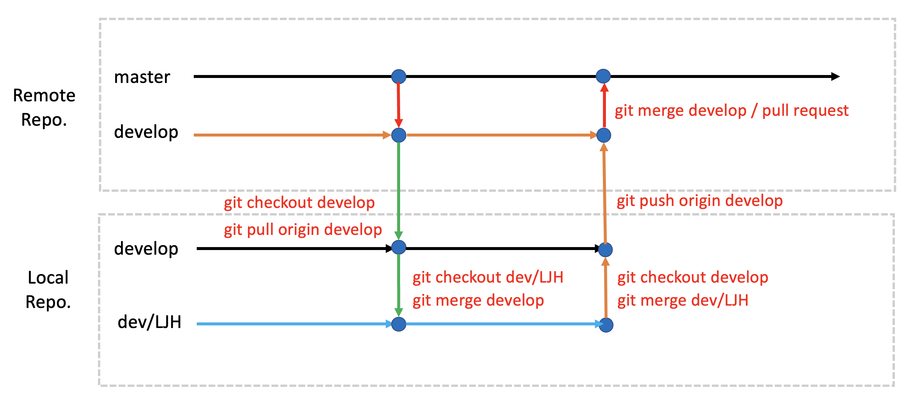

# 경기메타버스 캠퍼스 - 유니티엔진을 활용한 게임개발 2024


## 최종 발표


### 발표 일정
- 시연 및 발표 : 2024-09-06
- 발표 장소 : 11층 발표장
- 발표 시간 : 14:30 ~ 16:30


### 발표 순서
|  NO   | 팀명           | 프로젝트명                      | 플랫폼 | 팀장   | 팀원                                   |
| :---: | -------------- | ------------------------------- | ------ | ------ | -------------------------------------- |
|   1   | Auguest Pro    | 호텔 파라도르                   | VR     | 이정우 | 이정우, 서주민, 대여운                 |
|   2   | 춤추는 고래들  | 낮선 길잡이                     | AR     | 김영준 | 김영준, 국경호, 김시내, 백상윤, 서정윤 |
|   3   | 미정           | VR 잡입액션(aka.메탈기어솔리드) | VR     | 박찬빈 | 박찬빈, 이다현                         |
|   4   | 빗자루         | 쓰레받기                        | VR     | 전준우 | 강시은, 김민주, 전준우                 |
|   5   | 초보운전       | Ace Pilot                       | PC     | 이정후 | 이정후, 김우현                         |
|   6   | WST            | 전쟁 치료 시뮬레이션            | VR     | 강영우 | 강영우, 김현준                         |
|   7   | Ajou Sons | 역사 VR 방탈출                  | VR     | 손준표 | 손준표, 손현진                         |
|   8   | Crook          | Don't be cooked !               | VR     | 이효민 | 이효민, 정윤아, 정애란                 |

---


## 기획 발표문서

### 기획 문서 내용

- 프로젝트 명 (가칭)
- 콘텐츠 장르 (게임/교육/기타)
- 기획 의도
- 레퍼런스 게임 여부 
- 플레이 타임 고려
- 명확한 소비 대상층 선정

### 기획 발표

- 발표일자 : 2024/07/17

## 기획 팀 빌딩

- 3인 1팀 기본
- 선정된 기획에 대해 팀원간 아이디어 회의 (세부 기능에 대한)
- 대략적인 구현 기능 목록 정리 (트랠로 권장)

## 차주(07/24)까지 진행해야 하는 JOB

- 세부 기획 문서
- 상세설계 산출물
- 팀원별 역할 분담
- 팀명/ 프로젝트 명 확정
- 팀장 선임

## 세부 기획 문서 목차

- 프로젝트 명(가칭)
- 팀 소개
- 기획의도
- 게임 장르 및 플레이타임
- 소비 대상층
- 레퍼런스
- 시놉시스 (시나리오)
- 게임 플레이 소개 또는 플로우

## 상세설계 산출물

- 기획서(최종 - 팀구성 후 변경사항 반영)
- 시스템 구성도(Flow) [시스템 플로운 예시](https://blog.naver.com/onlybest01/220080008810)
- 스토리보드(콘티) [스토리보드 제작 사이트](https://miro.com/ko/templates/storyboard/)
- UI 구성도 (선택사항) [UI/UX 제작 사이트](https://miro.com/ko/templates/ux/)
- 상세 기능 목록(엑셀, 구글 시트)
- 메디치 카페 게시판에 업로드 - **경기 메타버스 캠버스/Unity프로젝트**  [문서 업로드](https://cafe.naver.com/ictacademy)
  - 업로드시 양식
    - 제목 : [팀명(가칭)] 세부기획 및 상세설계
    - 내용 : 압축하지 않고 업로드


## 최종 프로젝트 팀

|  NO   | 팀명           | 프로젝트명                      | 플랫폼 | 팀장   | 팀원                                   | 트렐로                                                                           |
| :---: | -------------- | ------------------------------- | ------ | ------ | -------------------------------------- | -------------------------------------------------------------------------------- |
|   1   | Crook          | Don't be cooked !               |        | 이효민 | 이효민, 정윤아, 정애란                 | [링크](https://trello.com/b/8ibTLxwA/suespaceforest-project)                     |
|   2   | 빗자루         | 쓰레받기                        |        |        | 강시은, 김민주, 전준우                 | [링크-노션](https://www.notion.so/Team-Broom-5c48a3ffec124a539a7bf5a6f9ad82bd)() |
|   3   | 춤추는 고래들  | 낮선 길잡이                     |        | 김영준 | 김영준, 국경호, 김시내, 백상윤, 서정윤 | [링크]()                                                                         |
|   4   | 닥트리오       | VR 굴착기 시뮬레이션            |        |        | 임정호, 홍덕화, 이일우                 | [링크]()                                                                         |
|   5   | 아주대 손씨 둘 | 역사 VR 방탈출                  |        |        | 손준표, 손현진                         | [링크](https://trello.com/b/9LepTTbM/my-trello-board)                            |
|   6   | 미정           | VR 잡입액션(aka.메탈기어솔리드) |        |        | 박찬빈, 이다현                         | [링크](https://trello.com/b/o6AMJUUw/gca-project)                                |
|   7   |                | 전쟁 트라우마 극복              |        |        | 강영우, 김현준                         | [링크]()                                                                         |
|   8   | 초보운전       | Ace Pilot                       |        |        | 이정후, 김우현                         | [링크](https://trello.com/b/84OApGUK/ace-pilot)                                  |
|   9   | Auguest Pro    | 호텔 파라도르                   |        |        | 이정우, 서주민, 대여운                 | [링크](https://trello.com/b/4bxTSn6u/unityproject2024augustpro)                  |
 


### 프로젝트 일정

| 일정              | 기간          |
| :---------------- | :------------ |
| **개발 기간**     | 07/26 ~ 09/04 |
| **중간 점검**     | 08/28(수)     |
| **발표 문서작성** | 08/29 ~       |
| **발표 문서리뷰** | 1차 09/04(수) |
| **알파 테스트**   |               |
| **발표 리허설**   | 09/04         |
| **발표**          | 09/06         |

- 프로젝트의 목적
  - 교육기간동안 습득한 게임 개발 역량을 종합적으로 사용한 최종 프로젝트로서 전반적인 개발 과정을 이해하고 다양한 시행착오를 통해 개개인의 개발 역량을 강화한다.
  - 협업을 통해 각각의 역할을 이해하고 개발자간의 연계 작업에 대한 능력을 향상 시킨다.

- 구현 주제

  - 개발할 콘텐츠의 주제 선정시 대상 연령층을 명확히 한다. (예: 성인, 청소년, 아동, ...)
  - 구현 디바이스(PC, 모바일)의 한계를 명확히 인지하고 콘텐츠의 리소스 및 전체적인 분위기(테마)를 선정한다.

- 팀 구성 및 팀장의 역할
  - 기본 3인 1팀으로 구성한다. (특별한 경우 4인 1팀까지도 허용)
  - 팀장은 반드시 팀원들의 동의를 거쳐 선정한다.
  - 팀장과 팀원은 수직적인 관계가 아니며 수평적인 관계임을 명심한다.
  - 팀장은 프로젝트의 전체 일정과 팀원의 업무 분담등 전체적인 프로젝트 관리의 책임을 진다.
  - 팀장은 수시로 프로젝트의 진행상황에 대해 지도강사와 소통한다.
  - 팀장은 팀원의 작업물에 대한 정기적인 통합(Merge)와 프로젝트 전체 백업을 진행한다.(최소 주 1회 이상)
  - 하원시 커밋 & 푸시, 등원시 풀(pull)한 후 작업 진행을 원칙
  - 팀원은 로컬HDD에 개별 백업을 매일 진행한다.(선택사항)

- 협업 및 형상관리
  - 일정관리는 **Trello** 또는 **Notion**을 활용하며 모니터링을 위해 지도 강사(myleje@gmail.com, hiyan@medici-edu.co.kr)를 초대한다. [(트렐로 trello.com)](https://trello.com) [트렐로 사용예제](https://brunch.co.kr/@uxstar/18)
  - 협업 메신저을 사용할 경우 슬렉([Slack](https://slack.com/intl/en-kr/))로 팀 내부적으로 사용하는 것도 권장.
  - 형상관리는 깃허브(Github)를 사용한다. (Unity 콜라보레이트도 괜찮으나 깃과 깃허브를 권장)
  - GitHub GUI 툴은 **[SourceTree](https://www.sourcetreeapp.com)**, [GitHub Desktop](https://desktop.github.com),   [GitKraken](https://www.gitkraken.com) 중 하나를 선택한다. (SourceTree 권장함.)
  - SourceTree는 팀원간의 깃 사용이 능숙해지는 중간 평가후 사용한다.(선택사항) 그전까지는 CLI(Command Line Interface)에서 명령어를 통해 작업한다.
  - 깃허브 사용시 개발자별 브랜치를 생성한다. 개발자 브랜치의 네이밍을 다음과 같이 **dev/영문이니셜** 방식을 추천.
    ```
    dev/LJH
    dev/PJW
    ```
  - 개발 브랜치(develop)를 운영할 것인지를 결정
  - 깃허브 사용시 다양한 충돌(conflict)를 경험하게될 것이며 이를 방지하거나 해결하는 경험을 쌓는다.
  - 팀장은 매일 팀원들의 소스 코드의 수동 백업 여부를 확인 및 관리한다.

### 차주 Git 수업 후 팀별 작업

- 깃허브 리포지토리 Owner 선정
- 깃허브 리포지토리 생성
- 팀원 업무 분장 (대략적인 업무)

### 프로젝트 표준안 정립

- 프로젝트 뷰의 폴더명 규약
- 함수(메소드) 명명 규칙 (Pascal Case)
- 변수 명명 규칙 (Camel Case)
- 로컬 백업 방식 및 주기 결정

---

## 깃 브랜치 전략
### Git Flow



- 작업 시작하기 전 깃 작업

```shell
# 로컬 조장소가 develop 브랜치인지 확인
git branch

# 만약 develop 브랜치가 아닌경우 develop 브랜치로 체크아웃
git checkout develop

# 원격 저장소의 develop 브랜치에서 가져오기(Pull)
git pull origin develop

# 충돌(Conflict)가 발생한 경우 해결한 후 Merge Commit 한다.
git add .
git commit -m "충돌해결 - 내용"

# 정상적으로 pull이 완료된 후 자신의 개발 브랜치로 체크아웃
git checkout dev/LJH

# 로컬 develop 저장소의 변경사항을 자신의 개발 브랜치로 Merge 한다.
git merge develop

# 충돌(Conflict)가 발생한 경우 해결한 후 Merge Commit 한다.
git add .
git commit -m "충돌해결 - 내용"

# 정상적으로 병합이 완료된 후 작업을 진행한다.

```

- 작업 종료 후 깃 작업

```shell
# 자신의 개발 브랜치의 작업내용을 모두 커밋한다.
git add .
git commit -m "작업 내용"

# 로컬 develop 브랜치로 체크아웃한다.
git checkout develop

# 자신의 개발 브랜치의 내용을 로컬 develop 브랜치로 병합(merge) 한다.
git merge dev/LJH

# 충돌(Conflict)가 발생한 경우 해결한 후 Merge Commit 한다.
git add .
git commit -m "충돌해결 - 내용"

# 충돌을 해결하거나 정상적으로 병합이 완료된 경우 원격 develop 브랜치로 push 한다.
git push origin develop

# 만약 원격 리포지토리에 변경 사항이 있을 경우 먼저 Pull 한 후 Push 한다.
```


## 터레인 및 라이트맵 깨지는 현상 방지

- .gitattributes 파일에 다음 라인 추가
- 유니티에서 터레인과 라이트맵 파일은 2진 파일로 생성

``` 
*Terrain*.asset binary
*Lightmap*.asset binary
*LightingData*.asset binary
```
---

### 발표 문서 작성

#### 1. 발표문서에 담겨야 할 내용

   - 기획 목적
   - 개발 구성원 소개 및 담당 업무
   - 개발 환경
     - 개발 툴 : Unity, Blender, PhotoShop, ...
     - 소스 관리 방법(기법) : Github, Trello, Slack, Collaborator, Google Docs, ...
     - 사용 하드웨어 : Quest, AR Device
   - 개발 일정별 진행상황 : [간트차트](https://ko.wikipedia.org/wiki/간트_차트) 또는 엑셀
   - 구현한 주요 기능
     - **짧은 동영상 자료**(mp4)를 첨부 (Animated GIF 사용금지)
   - 개발 후기 : 아쉬웠던 점, 느낀 점, 향후 구현하고 싶은 기능등을 기술.

#### 2. 발표문서 작성시 피해야 할 내용 또는 작성 방식

   - **C# 소스 코드** 복사해 붙여넣기한 후 라인 바이 라인 설명하는 것은 금지한다.
   - **외부 링크는 금지**한다. (발표장의 인터넷 환경에 따라서 연결 불가한 경우가 있음.)
   - 파워 포인트의 애니메이션 기능은 기본적으로는 사용하지 않는다. 단, 반드시 필요한 경우 과도하지 않게 사용한다.


<!-- 
### 프로젝트 발표 문서 작성

- [발표문서 공식 탬플릿](https://docs.google.com/presentation/d/1HYUKU_M5ALghtoDSjGQGM6ADzBeRadT5/edit?usp=sharing&ouid=109306707304462513227&rtpof=true&sd=true)

- 발표문서는 11월 06일까지(1차 리뷰전) 아래 구글 드라이브에 업로드해주세요. (별도로 사용한 폰트가 있다면 같이 업로드)

- [발표문서 업로드](https://drive.google.com/drive/folders/1NE5QTQISsadFqUXtCXZ77q3PfxwcffSl?usp=share_link)
- PPT로 작성

### 발표 문서 작성

#### 1. 발표문서에 담겨야 할 내용

   - 기획 목적
   - 개발 구성원 소개 및 담당 업무
   - 개발 환경
     - 개발 툴 : Unity, Blender, PhotoShop, ...
     - 소스 관리 방법(기법) : Github, Trello, Slack, Collaborator, Google Docs, ...
     - 사용 하드웨어 : Quest, AR Device
   - 개발 일정별 진행상황 : [간트차트](https://ko.wikipedia.org/wiki/간트_차트) 또는 엑셀
   - 구현한 주요 기능
     - **짧은 동영상 자료**(mp4)를 첨부 (Animated GIF 사용금지)
   - 개발 후기 : 아쉬웠던 점, 느낀 점, 향후 구현하고 싶은 기능등을 기술.

#### 2. 발표문서 작성시 피해야 할 내용 또는 작성 방식

   - **C# 소스 코드** 복사해 붙여넣기한 후 라인 바이 라인 설명하는 것은 금지한다.
   - **외부 링크는 금지**한다. (발표장의 인터넷 환경에 따라서 연결 불가한 경우가 있음.)
   - 파워 포인트의 애니메이션 기능은 기본적으로는 사용하지 않는다. 단, 반드시 필요한 경우 과도하지 않게 사용한다.


---

## 최종 발표

### 리허설 순서

|  NO   | 팀명        | 프로젝트명     | 플랫폼 | 발표자 | 팀장                        | 팀원 |
| :---: | ----------- | -------------- | ------ | ------ | --------------------------- | ---- |
|   1   | NaN         | Dungeon Master | VR     | 성진기 | 성진기,이상인,박채림,김승현 |
|   2   | GreenTea    | 무사히 출근    | VR     | 전지은 | 전지은, 이서랑              |
|   3   | KGJ         | Zero Gravity   | VR     | 김길주 | 김길주                      |
|   4   | M&H         | VR Cart        | VR     | 허준원 | 문성군 , 허준원             |
|   5   | Animal Town | Wedding Road   | VR     | 김진희 | 심재근, 김진희              |


### 발표 일정
- 시연 및 발표 : 2023-11-10
- 시연 시간 : 12:30 ~ 14:30
- 발표 장소 : 나폴리
- 발표 시간 : 14:30 ~ 16:30

### 발표 후 일정 
  - 기념 사진 촬영
  - 수료증 수여
  - 시연장소 정리
  - 노트북 반납

### 발표 순서

|  NO   | 팀명        | 프로젝트명     | 플랫폼 | 발표자 | 팀원                        |
| :---: | ----------- | -------------- | ------ | ------ | --------------------------- |
|   1   | M&H         | VR Cart        | VR     | 허준원 | 문성군 , 허준원             |
|   2   | Animal Town | Wedding Road   | VR     | 김진희 | 심재근, 김진희              |
|   3   | GreenTea    | 무사히 출근    | VR     | 전지은 | 전지은, 이서랑              |
|   4   | NaN         | Dungeon Master | VR     | 김승현 | 성진기,이상인,박채림,김승현 |
|   5   | KGJ         | Zero Gravity   | VR     | 김길주 | 김길주                      |
 -->
